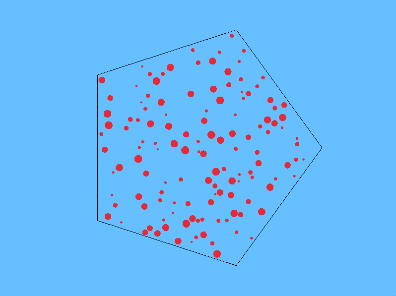

# Convex polygon billiards



---

**Convex polygon billiards** is a C++ simulation project that models the motion of particles within a convex polygonal boundary using reflective boundary conditions. 
Particles are initialized randomically inside the polygon and their velocity is assigned using a uniform distribution between 2 limiting symmetrical values.
Also the particles radiuses are assigned using a uniform distribution between 2 limiting values.

The user can at the start of the simulation choose the (regular) polygon by selecting the number of sides and also choose the particle number to be initialized inside the polygon.

Graphics is handled via the [Raylib](https://www.raylib.com/) library.

--- 

## 📥 Download a precompiled release

Precompiled binaries are available under the [Releases](https://github.com/nunziatodamino/convex_polygon_billiards/releases) section. Just download the binary for your platform, make it executable if needed:

```bash
chmod +x convex_polygon_billiards
./convex_polygon_billiards
```
---

## Build process

If you prefer to build the project yourself instead of using a precompiled [release](https://github.com/nunziatodamino/convex_polygon_billiards/releases), follow the steps below.

### Requirements

- C++17 or later
- [Raylib](https://github.com/raysan5/raylib) installed and linked properly (it should be by default)
- CMake 3.10+
- A C++ compiler (GCC, Clang, etc.)

### Build instructions

```bash
# Clone the repository
git clone https://github.com/nunziatodamino/convex_polygon_billiards.git
cd convex_polygon_billiards

# Create and enter build directory
mkdir build
cd build

# Configure and build in Release mode
cmake -DCMAKE_BUILD_TYPE=Release ..
cmake --build .
```

The compiled executable will be located in the `build/` directory.

---

## 📄 License

This project is released under the MIT License.

---